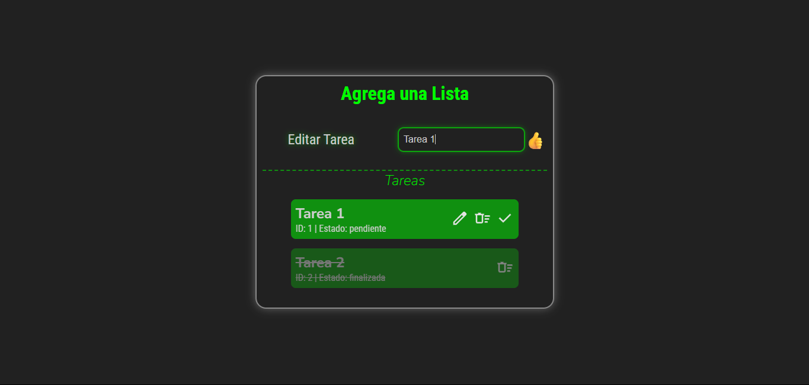

# 🗂️ Crear Tareas

Aplicación web simple para gestionar tareas: permite **crear**, **editar**, **eliminar** y **marcar como finalizadas**.

Este proyecto fue desarrollado como ejercicio práctico por [@maomachado](https://github.com/maomachado).

## 📸 Vista Previa



## ✅ Funcionalidades

- 📝 Crear nuevas tareas.
- ✏️ Editar tareas existentes.
- ✅ Marcar tareas como finalizadas.
- ❌ Eliminar tareas.
- 🧠 Lógica de edición con detección por ID.
- 🎨 Estilos básicos con clases para tareas finalizadas.
- 🚫 Deshabilita botones para tareas finalizadas.

## 🚀 Cómo usar

Clona el repositorio:

```bash
git clone https://github.com/maomachado/CrearTareas.git
```

## 📄 Licencia

Este proyecto es de código abierto y puedes usarlo para fines educativos o personales.
